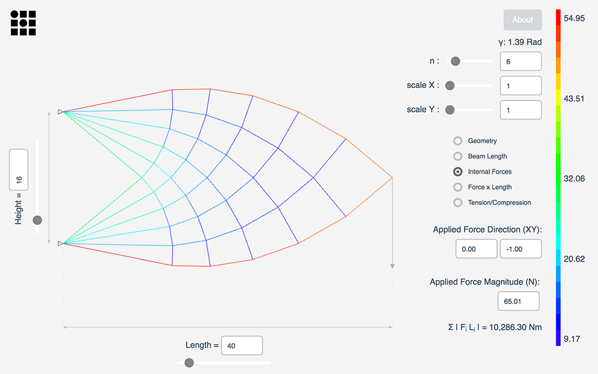

# MichellStructures

This is a web-based simulation tool that visualizes geometric properties and static internal forces in a loaded Michell cantilever anchored at two points.  A live demo is available at <a href="http://git.amandaghassaei.com/MichellStructures/" target="_blank">git.amandaghassaei.com/MichellStructures</a>.

Michell geometry is parameterized by total length (Length), distance between attachment points (Height), and number of truss layers (n) - additional x and y scaling may also be applied.  Internal static forces are calculated using the [method of joints](https://en.wikibooks.org/wiki/Statics/Method_of_Joints).

Instructions:
Drag on the applied force to change its magnitude and direction.  Use the sliders to adjust geometric parameters of the Michell truss.  Mouse over a beam to see more information about its properties.

Built by [Amanda Ghassaei](http://www.amandaghassaei.com) as a homework assignment for [Computational Structural Design and Optimization](https://architecture.mit.edu/subject/fall-2016-4450).
